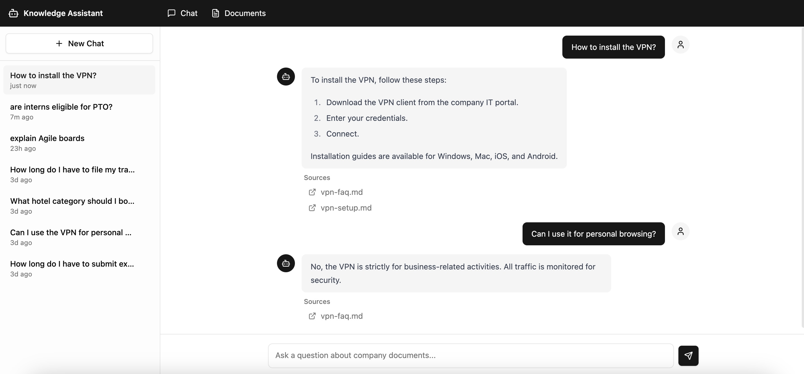
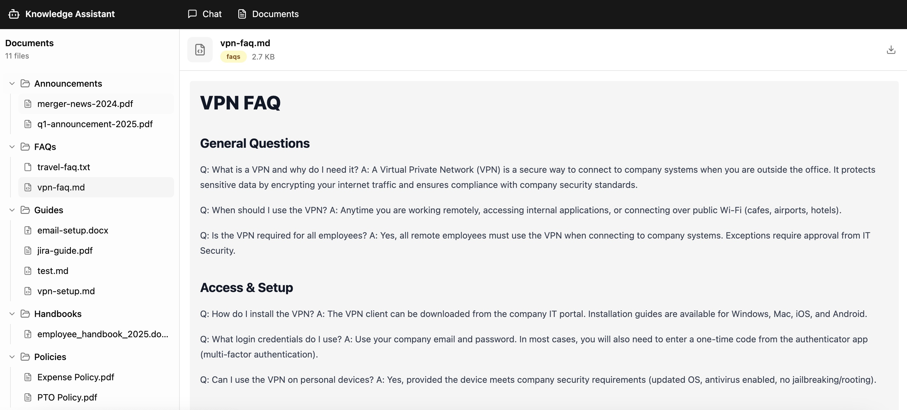

# RAG Knowledge Assistant

A full-stack **RAG** (Retrieval-Augmented Generation) application that answers questions based on company documents with source citations.





## Architecture

- **Backend**: LangChain + FastAPI
- **LLM Providers**: OpenAI + Anthropic
- **Storage**: PostgreSQL/PGVector + Redis
- **Frontend**: Next.js + TypeScript + Shadcn UI
- **Observability**: LangSmith tracing + structured logging + Ragas evaluation
- **Infrastructure**: Docker Compose

## Features

### Ingestion
- Multi-format support: PDF, DOCX, Markdown, and plain text
- Bulk ingestion from data directories
- Incremental document updates
- Category organization (FAQs, guides, policies, etc.)

### Retrieval
- Cohere reranking for improved relevance
- Redis semantic caching for faster repeated queries
- Multi-model routing for different tasks

### Generation
- Grounded responses with source citations
- Streaming responses via SSE
- Multi-turn conversation history with question condensing


## Quick Start

1. **Copy environment variables**:
   ```bash
   cp .env.example .env
   # Edit .env with your OPENAI_API_KEY, ANTHROPIC_API_KEY, and optionally LANGSMITH_API_KEY, COHERE_API_KEY
   ```

2. **Start backend**:
   ```bash
   docker compose up --build
   ```
   This starts PostgreSQL, Redis, and the backend API.

3. **Start frontend** (in a separate terminal):
   ```bash
   cd frontend && npm install && npm run dev
   ```

4. **Ingest documents**:
   ```bash
   curl -X POST http://localhost:8000/api/documents/ingest
   ```

5. **Open the app**: http://localhost:3000

## Services

| Service    | URL                   | Description              |
|------------|-----------------------|--------------------------|
| Frontend   | http://localhost:3000  | Next.js dev server       |
| Backend    | http://localhost:8000  | FastAPI REST + SSE       |
| PostgreSQL | localhost:5432        | PGVector storage         |
| Redis      | localhost:6379        | Semantic cache           |
| Redis UI   | http://localhost:8001  | Redis Stack browser      |


## Evaluation

Run RAG evaluation using Ragas metrics:
- **Faithfulness**: Answer grounded in context
- **Answer Relevancy**: Relevance of answer to question
- **Context Precision**: Precision of retrieved contexts
- **Context Recall**: Recall of relevant information

```bash
# Via API
curl -X POST http://localhost:8000/api/evaluate

# Via CLI (from project root)
python eval/run_eval.py --dataset eval/test_dataset.json --output eval/results.json
```

## API Endpoints

- `POST /api/chat` - Chat with SSE streaming
- `GET /api/conversations` - List conversations
- `GET /api/conversations/{id}` - Get conversation with messages
- `DELETE /api/conversations/{id}` - Delete conversation
- `POST /api/documents/ingest` - Ingest documents from /data
- `POST /api/documents/upload` - Upload a document
- `GET /api/documents` - List all documents
- `GET /api/documents/{id}` - Get/update/delete a document
- `GET /api/documents/{id}/preview` - Preview/download document
- `POST /api/evaluate` - Run Ragas evaluation
- `GET /health` - Health check (DB + Redis)


## Documents

Place documents in `/data` organized by category:
- `handbooks/` - Employee handbooks
- `policies/` - Company policies
- `faqs/` - FAQs
- `guides/` - Setup guides
- `announcements/` - Company announcements

Supported formats: PDF, DOCX, MD, TXT

You can also upload documents via the `/api/documents/upload` endpoint.
